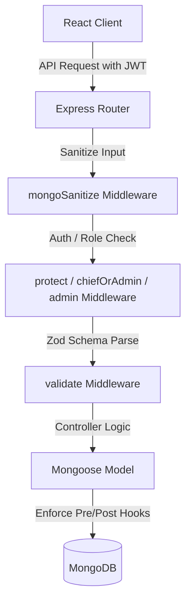

# Architecture Graph

## 1. Frontend Component Graph
| Route / Page | Components Rendered | Shared / Unique | State Source | API Endpoints Called |
| :--- | :--- | :--- | :--- | :--- |
| `/` (Home) | Home, Navbar, Footer, ThemeToggle | Shared Layout | AuthContext | None |
| `/login` | Login, ThemeToggle, NotificationListener | Unique | AuthContext | `POST /api/auth/google`, `POST /api/auth/login` |
| `/dashboard` | Dashboard, Layout, ProfileCard | Shared Layout | AuthContext, React State | `GET /api/auth/me`, `GET /api/dashboard/admin-summary` |
| `/leaderboard` | Leaderboard, Layout, LeaderboardTable | Shared Layout | React State | `GET /api/submissions/leaderboard` |
| `/clans` | Clans, Layout, ClanCard, ClanDetailsModal | Shared Layout | React State | `GET /api/clans`, `POST /api/clans/:id/join` |
| `/profile/:username`| Profile, Layout, BadgeGrid, SubmissionList | Shared Layout | React State | `GET /api/profile/:username`, `GET /api/badges/username/:username` |
| `/challenge/:id` | ChallengeDetails, Layout, MonacoEditor | Shared Layout | Monaco, React State | `GET /api/challenges/:id`, `POST /api/submissions` |
| `/chief-panel` | ClanChiefPanel, Layout, RequestTable | Shared Layout | ClanChiefRoute, State | `GET /api/clans/mine`, `POST /api/clans/:id/approve/:userId` |

## 2. Backend Route & Logic Graph
| Endpoint | Method | Middleware Chain | Controller / Service | DB Models Touched |
| :--- | :--- | :--- | :--- | :--- |
| `POST /api/auth/google` | POST | validate(googleAuthSchema) | googleAuth / issueSession | User, RefreshToken, AdminEmail |
| `POST /api/auth/login` | POST | None (test only) | testLogin / issueSession | User, RefreshToken |
| `GET /api/auth/me` | GET | protect | getMe | User, XpLog |
| `POST /api/badges/award/:userId` | POST | protect, chiefOrAdmin | awardBadge | User, Badge |
| `DELETE /api/badges/revoke/:userId/:badgeId` | DELETE | protect, chiefOrAdmin | revokeBadge | User, Badge |
| `GET /api/challenges` | GET | protect, validate(challengeQuerySchema) | getChallenges | Challenge, QuestionSet |
| `POST /api/submissions` | POST | protect, validate(submissionCreateSchema) | submitCode | Submission, Challenge, User |
| `PUT /api/users/:id/ban` | PUT | protect, admin | banUser | User, AuditLog |
| `POST /api/users/:id/warn` | POST | protect, admin | warnUser | User, AuditLog |
| `GET /api/resources` | GET | protect | getResources (lean) | Resource |
| `GET /api/question-sets` | GET | protect | getQuestionSets (lean) | QuestionSet |

## 3. Database Schema Graph (MongoDB / Mongoose)
| Collection | Key Fields | Indexes | Unbounded Growth Risk | Missing Validations |
| :--- | :--- | :--- | :--- | :--- |
| `users` | firebaseUid, email, username, role, points, status | `{ username: 1 }` (partial), `{ regNo: 1 }` (partial), `{ points: -1, solvedProblems: -1 }` | Low | None (uses custom format validation regexes) |
| `challenges` | title, description, difficulty, points, codeSnippets | `{ createdAt: -1 }`, `{ difficulty: 1, category: 1 }`, text index on `{ title, description }` | Low | None |
| `submissions` | challengeId, userId, code, language, status | `{ userId: 1, submittedAt: -1 }`, `{ challengeId: 1, submittedAt: -1 }` | Medium (high-frequency user code runs) | None |
| `clans` | name, tag, chief, members, requests, status | `{ name: 1 }` (partial), `{ tag: 1 }` (partial) | Low (clan limit prevents unbounded size) | None |
| `auditlogs` | action, targetUserId, performedBy, previousValue, newValue | `{ targetUserId: 1 }`, `{ performedBy: 1 }`, `{ timestamp: 1 }` (immutable inserts only) | Low (only admin moderation actions logged) | None |
| `resources` | title, folder, type, url, uploadedBy | `{ folder: 1 }`, `{ uploadedBy: 1 }` | Low | None |
| `questionsets` | title, weekNumber, deadline, targetLevel, status | `{ weekNumber: 1 }`, `{ deadline: 1 }`, `{ status: 1 }` | Low | None |

## 4. Full-Stack Sync Points
| Data Variable | Frontend Location | Backend Validation | Database Constraint | In Sync? |
| :--- | :--- | :--- | :--- | :--- |
| `user.role` | AuthContext -> App Router | `protect`, `admin`, `chiefOrAdmin` middlewares | enum: `['user', 'moderator', 'admin', 'clan-chief', 'superAdmin']` | Yes |
| `challenge.difficulty`| Monaco Editor -> Score Calc | `challengeQuerySchema` enum validation | enum: `['Easy', 'Medium', 'Hard']` | Yes |
| `user.status` | Navigation blocker | Check status inside `protect` auth middleware | enum: `['Active', 'Inactive', 'Warned', 'Banned']` | Yes |

